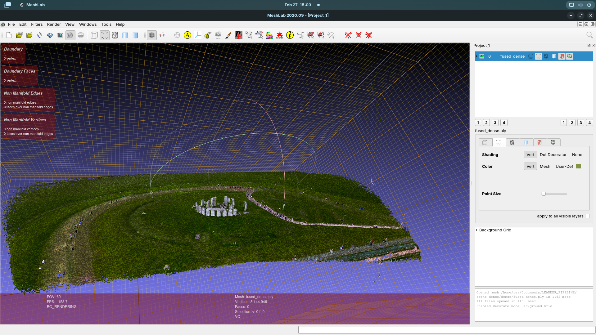
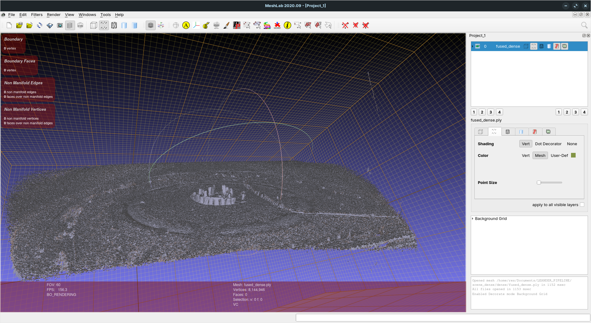

# Gaussian Splatting Data Preparation Pipeline

High-quality, reproducible data preparation for 3D Gaussian Splatting using `ffmpeg` and `COLMAP`.

This project automates:
- Frame extraction (or image folder ingestion)
- Feature extraction and matching
- Sparse reconstruction with automatic fallback mapper settings
- Optional sparse point densification (`point_triangulator`)
- Optional dense reconstruction (`PatchMatch` + `stereo_fusion`)
- Export of `.ply` and COLMAP text models for downstream 3DGS training

## Requirements

- Linux shell (`bash`)
- `ffmpeg`
- `colmap` (CUDA-enabled build recommended for dense reconstruction)

Check dependencies:

```bash
ffmpeg -version
colmap -h
```

If `colmap` is not on `PATH`, the script tries `/snap/bin/colmap`.  
You can also set it explicitly:

```bash
export COLMAP_BIN=/absolute/path/to/colmap
```

## Quick Start

```bash
./run_gs_pipeline.sh \
  --input /path/to/capture.mp4 \
  --workspace ./scene01 \
  --fps 2 \
  --max-image-size 3200 \
  --camera-model OPENCV \
  --matcher exhaustive \
  --dense
```

For input images instead of video:

```bash
./run_gs_pipeline.sh --input /path/to/images --workspace ./scene02 --dense
```

## Typical Workflows

Best quality (slower):

```bash
./run_gs_pipeline.sh \
  --input ./capture.mp4 \
  --workspace ./scene_quality \
  --profile quality \
  --matcher exhaustive \
  --dense
```

Faster high-quality preset:

```bash
./run_gs_pipeline.sh \
  --input ./capture.mp4 \
  --workspace ./scene_fast \
  --profile fast_hq
```

Sparse-only export:

```bash
./run_gs_pipeline.sh \
  --input ./capture.mp4 \
  --workspace ./scene_sparse \
  --no-sparse-densify
```

## Key Arguments

- `--input`: Video file or image directory (required)
- `--workspace`: Output workspace directory (required)
- `--profile quality|fast_hq`: Sparse reconstruction preset
- `--dense`: Enable dense reconstruction
- `--dense-profile balanced|hq`: Dense quality/speed preset
- `--dense-input-type geometric|photometric`: Stereo fusion mode
- `--fps`: Frame extraction rate for video input
- `--max-image-size`: Feature extraction image clamp
- `--camera-model`: COLMAP camera model (`OPENCV` and `RADIAL` recommended for phones)
- `--matcher exhaustive|sequential`: Matching strategy
- `--mask-path`: Directory of per-image masks for dynamic-object suppression
- `--cpu`: Force CPU SIFT/matching
- `--print-train-cmd`: Print a suggested `train.py` command

Use `./run_gs_pipeline.sh --help` for the full list.

## Outputs

Primary outputs are written inside `--workspace`.

- Images used by COLMAP: `workspace/images/`
- COLMAP database: `workspace/database.db`
- Sparse model base: `workspace/sparse/0/`
- Sparse densified model (default path when successful): `workspace/sparse/triangulated/`
- Sparse PLY: `workspace/sparse/*/points3D_sparse.ply`
- Sparse text model: `workspace/sparse/*/text/`
- Dense PLY (when `--dense` succeeds): `workspace/dense/fused_dense.ply`

`*` is typically `triangulated` (default flow) or `0` (when sparse densification is disabled or unavailable).

## Results (Screenshots)

<p align="center">
  
  
</p>

## Metrics Summary

For the comparison of `scene.mp4` (decoded at `2 fps`) against the GS input frames in `scene_dense/images` (43 frames):

- **PSNR:** `35.096 dB` (higher is better)
- **SSIM:** `0.995234` (closer to 1 is better)
- **LPIPS (AlexNet):** `0.000000` (lower is better)

Detailed methodology, channel-wise values, and reproducibility commands are in [METRICS_REPORT.md](METRICS_REPORT.md).

## Quality Guidance

- Capture with stable motion and strong parallax around the subject.
- Keep overlap high (roughly 60-80% across neighboring views).
- Avoid motion blur, focus pumping, and auto-exposure jumps.
- Start with `--fps 2`; lower for slow motion, raise for fast motion.
- Prefer `--matcher exhaustive` for robust results on smaller/mid-size datasets.
- Keep `--max-image-size` as high as GPU memory allows (commonly `2000-4000`).
- If sparse clouds are thin, keep sparse densification enabled and tune:
  - lower `--sift-peak-threshold` slightly (example: `0.0035`)
  - raise `--sift-max-num-features`

## Masks

When using `--mask-path`, masks must match image filenames and relative layout in `workspace/images`.
Masked regions are ignored during feature extraction, which helps with dynamic objects and background clutter.

## Troubleshooting

- `Error: required command not found: colmap`  
  Set `COLMAP_BIN` to your executable path.
- Dense step skipped on non-CUDA COLMAP  
  Sparse outputs are still valid for many 3DGS pipelines.
- Weak or empty sparse model  
  Try `--matcher sequential`, lower `--fps`, and improve capture overlap/parallax.
- Headless server with no valid display  
  Script auto-falls back to CPU SIFT/matching; you can also force `--cpu`.

## Integration with 3DGS Training

The pipeline exports standard COLMAP artifacts used by most 3DGS workflows:
- Camera and pose text files: `cameras.txt`, `images.txt`, `points3D.txt`
- Initial point cloud in `.ply` format (sparse and optionally dense)

These outputs are directly consumable by common Gaussian Splatting training setups.
