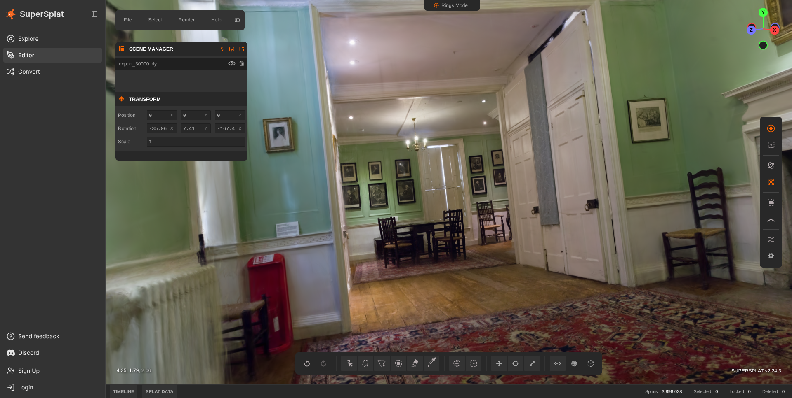
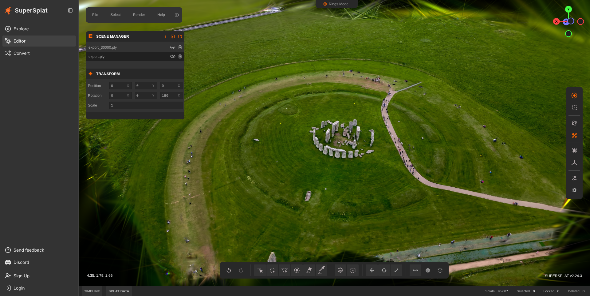

# Gaussian Splatting Data Preparation Pipeline

High-quality, reproducible data preparation for 3D Gaussian Splatting using `ffmpeg` and `COLMAP`.

This project automates:
- Frame extraction (or image folder ingestion)
- Feature extraction and matching
- Sparse reconstruction with automatic fallback mapper settings
- Optional sparse point densification (`point_triangulator`)
- Optional dense reconstruction (`PatchMatch` + `stereo_fusion`)
- Export of `.ply` and COLMAP text models for downstream 3DGS training

The repository currently exposes two entry points:
- `./run_gs_pipeline.sh`: GUI-aware launcher that opens the Tkinter pipeline monitor when a desktop display is available
- `./run_gs_pipeline_core.sh`: the underlying shell pipeline for direct or headless runs

## Requirements

- Linux shell (`bash`)
- `ffmpeg`
- `colmap` (CUDA-enabled build recommended for dense reconstruction)

Check dependencies:

```bash
ffmpeg -version
colmap -h
```

If `colmap` is not on `PATH`, the script tries `/snap/bin/colmap`.  
You can also set it explicitly:

```bash
export COLMAP_BIN=/absolute/path/to/colmap
```

## Quick Start

Open the GUI launcher:

```bash
./run_gs_pipeline.sh
```

Then choose an input file or folder, choose a workspace, toggle `Dense`, `Brush Auto`, and `Brush Viewer`, and click `Start Pipeline`.

Run the pipeline directly in the shell without the GUI:

```bash
RUN_GS_PIPELINE_NO_GUI=1 ./run_gs_pipeline.sh \
  --input /path/to/capture.mp4 \
  --workspace ./scene01 \
  --fps 2 \
  --max-image-size 3200 \
  --camera-model OPENCV \
  --matcher exhaustive \
  --dense
```

For input images instead of video:

```bash
RUN_GS_PIPELINE_NO_GUI=1 ./run_gs_pipeline.sh --input /path/to/images --workspace ./scene02 --dense
```

## Typical Workflows

Best quality (slower):

```bash
./run_gs_pipeline.sh \
  --input ./capture.mp4 \
  --workspace ./scene_quality \
  --profile quality \
  --matcher exhaustive \
  --dense
```

Faster high-quality preset:

```bash
./run_gs_pipeline.sh \
  --input ./capture.mp4 \
  --workspace ./scene_fast \
  --profile fast_hq
```

Robust high-quality preset (recommended for consistency across varied captures):

```bash
./run_gs_pipeline.sh \
  --input ./capture.mp4 \
  --workspace ./scene_robust \
  --profile robust_hq \
  --matcher auto \
  --max-images 320 \
  --dense \
  --dense-profile hq \
  --dense-input-type photometric
```

Reconstruction + benchmark gate (for hold-out GT vs rendered outputs):

```bash
./run_gs_pipeline.sh \
  --input ./capture.mp4 \
  --workspace ./scene_eval \
  --profile robust_hq \
  --dense \
  --dense-profile hq \
  --benchmark-ref ./holdout_gt/frame_%06d.png \
  --benchmark-test-pattern ./holdout_render/frame_%06d.png \
  --benchmark-lpips \
  --benchmark-min-psnr 28 \
  --benchmark-min-ssim 0.92 \
  --benchmark-max-lpips 0.22
```

Reconstruction + automatic Brush training/export:

```bash
RUN_GS_PIPELINE_NO_GUI=1 ./run_gs_pipeline.sh \
  --input ./capture.mp4 \
  --workspace ./scene_brush \
  --profile robust_hq \
  --dense \
  --brush-total-steps 30000 \
  --brush-export-path brush_exports
```

Current repo defaults already enable `Brush Auto` and `Brush Viewer`, so the explicit `--brush-auto` and `--brush-with-viewer` flags are only needed if you override those defaults elsewhere.

Sparse-only export:

```bash
./run_gs_pipeline.sh \
  --input ./capture.mp4 \
  --workspace ./scene_sparse \
  --no-sparse-densify
```

## Key Arguments

- `--input`: Video file or image directory (required)
- `--workspace`: Output workspace directory (required)
- `--profile quality|fast_hq|robust_hq`: Sparse reconstruction preset
- `--dense`: Enable dense reconstruction
- `--dense-profile balanced|hq`: Dense quality/speed preset
- `--dense-input-type geometric|photometric`: Stereo fusion mode
- `--fps`: Frame extraction rate for video input
- `--max-image-size`: Feature extraction image clamp
- `--camera-model`: COLMAP camera model (`OPENCV` and `RADIAL` recommended for phones)
- `--matcher exhaustive|sequential|auto`: Matching strategy (`auto` picks based on image count)
- `--max-images`: Uniformly subsample large frame sets for smoother, faster runs (`0` disables)
- `--benchmark-ref`: Reference video/pattern for post-run metric evaluation
- `--benchmark-test-pattern`: Test video/pattern for post-run metric evaluation
- `--benchmark-fps`: FPS used to decode any benchmark video inputs
- `--benchmark-lpips`: Enable LPIPS in post-run benchmark (`--benchmark-lpsis` alias also works)
- `--benchmark-min-psnr`, `--benchmark-min-ssim`, `--benchmark-max-lpips`: Optional quality gates
- `--benchmark-json`: Optional benchmark result JSON path (defaults to `workspace/benchmark_metrics.json`)
- `--mask-path`: Directory of per-image masks for dynamic-object suppression
- `--brush-auto`: Automatically hand the finished workspace to Brush for training/export
- `--brush-bin`: Path to the Brush executable (defaults to local bundled app if present)
- `--brush-with-viewer`: Launch Brush with its viewer while training
- `--brush-total-steps`: Brush training step count
- `--brush-max-resolution`: Brush image resolution clamp
- `--brush-export-every`: Brush export cadence
- `--brush-export-path`: Output folder under the workspace for Brush exports
- `--brush-export-name`: Brush export filename template (example: `export_{iter}.ply`)
- `--cpu`: Force CPU SIFT/matching
- `--print-train-cmd`: Print a suggested `train.py` command

Use `./run_gs_pipeline.sh --help` for the full list.

## GUI Launcher

When `DISPLAY` is available, `./run_gs_pipeline.sh` opens the Tkinter monitor instead of starting the shell pipeline immediately. The GUI allows you to:

- Select a video file or an image directory
- Select a workspace directory
- Toggle `Dense`, `Brush Auto`, and `Brush Viewer`
- Start or cancel the pipeline
- Watch progress, stage status, live logs, and VRAM usage

To bypass the GUI and run the core shell pipeline directly:

```bash
RUN_GS_PIPELINE_NO_GUI=1 ./run_gs_pipeline.sh --input ./scene.mp4 --workspace ./scene_dense --dense
```

## Outputs

Primary outputs are written inside `--workspace`.

- Images used by COLMAP: `workspace/images/`
- COLMAP database: `workspace/database.db`
- Sparse model base: `workspace/sparse/0/`
- Sparse densified model (default path when successful): `workspace/sparse/triangulated/`
- Sparse PLY: `workspace/sparse/*/points3D_sparse.ply`
- Sparse text model: `workspace/sparse/*/text/`
- Dense PLY (when `--dense` succeeds): `workspace/dense/fused_dense.ply`
- Brush exports (when `--brush-auto` is enabled): `workspace/brush_exports/`

`*` is typically `triangulated` (default flow) or `0` (when sparse densification is disabled or unavailable).

## Brush Integration

If Brush is installed locally, the pipeline can launch it automatically after reconstruction. The pipeline passes the finished workspace directly to Brush, which can then train and export splats using the COLMAP data produced by this repo.

By default the script looks for a bundled Brush binary at:

```bash
./brush-app-x86_64-unknown-linux-gnu/brush_app
```

You can override that with `--brush-bin`.

Current defaults in `run_gs_pipeline_core.sh`:

- `BRUSH_AUTO="1"`
- `BRUSH_WITH_VIEWER="1"`

That means Brush training/export and the Brush viewer are started automatically unless you change those defaults in the script.

## Results (Screenshots)

<p align="center">
  
  
</p>

## Metrics Summary

Current 3DGS-style image-quality metrics are taken from the held-out Brush export evaluation documented in [METRICS_REPORT.md](METRICS_REPORT.md).

For the `drjohnson_dense_brush` workspace at export step `30000`:

- **PSNR:** `33.194151 dB` (higher is better)
- **SSIM:** `0.937046` (closer to 1 is better)
- **LPIPS (AlexNet):** `0.157475` (lower is better)

Those values compare saved held-out renders from the trained Brush export against held-out reference images, which makes them actual reconstruction/rendering metrics rather than source-image extraction checks.

Brush's internal evaluation at iteration `30000` for the same run:

- **PSNR:** `29.965265 dB`
- **SSIM:** `0.9023107`

Detailed methodology, dataset split, and reproducibility commands are in [METRICS_REPORT.md](METRICS_REPORT.md).

### Automatic evaluation helper

A small convenience script, `evaluate.py`, is included at the repository root and
produces sequence-level PSNR/SSIM averages, optional LPIPS, and optional threshold
pass/fail status (useful for benchmark gating in CI or repeatable experiments).

Usage example:

```bash
# run inside the workspace root (make executable if necessary)
python evaluate.py \
    --ref scene.mp4 \
    --test-pattern "scene_dense/images/frame_%06d.png" \
    --fps 2 \
    --lpips \
    --min-psnr 30 \
    --min-ssim 0.95 \
    --max-lpips 0.20 \
    --json-out ./metrics.json
```

The script requires `ffmpeg` on your PATH; LPIPS computation additionally
needs Python packages `torch`, `lpips`, and `Pillow` which are available in
the `.venv_metrics` virtual environment.

## Quality Guidance

- Capture with stable motion and strong parallax around the subject.
- Keep overlap high (roughly 60-80% across neighboring views).
- Avoid motion blur, focus pumping, and auto-exposure jumps.
- Start with `--fps 2`; lower for slow motion, raise for fast motion.
- Prefer `--matcher exhaustive` for robust results on smaller/mid-size datasets.
- Keep `--max-image-size` as high as GPU memory allows (commonly `2000-4000`).
- If sparse clouds are thin, keep sparse densification enabled and tune:
  - lower `--sift-peak-threshold` slightly (example: `0.0035`)
  - raise `--sift-max-num-features`

## Masks

When using `--mask-path`, masks must match image filenames and relative layout in `workspace/images`.
Masked regions are ignored during feature extraction, which helps with dynamic objects and background clutter.

## Troubleshooting

- `Error: required command not found: colmap`  
  Set `COLMAP_BIN` to your executable path.
- `Error: brush binary not found`  
  The bundled default path is `./brush-app-x86_64-unknown-linux-gnu/brush_app`; override with `--brush-bin` if needed.
- Dense step skipped on non-CUDA COLMAP  
  Sparse outputs are still valid for many 3DGS pipelines.
- Dense fusion ends with `Killed` / OOM  
  Reduce `--fps`, cap with `--max-images`, use `--dense-profile balanced`, or skip `--dense`.
- Weak or empty sparse model  
  Try `--matcher sequential`, lower `--fps`, and improve capture overlap/parallax.
- Headless server with no valid display  
  Script auto-falls back to CPU SIFT/matching; you can also force `--cpu`.
- GUI does not open  
  Run from a desktop session, or bypass the GUI with `RUN_GS_PIPELINE_NO_GUI=1`.

## Integration with 3DGS Training

The pipeline exports standard COLMAP artifacts used by most 3DGS workflows:
- Camera and pose text files: `cameras.txt`, `images.txt`, `points3D.txt`
- Initial point cloud in `.ply` format (sparse and optionally dense)

These outputs are directly consumable by common Gaussian Splatting training setups.

## Leakage-Safe Hold-Out Evaluation

The repository previously included a helper script (`run_gaussian_holdout_eval.sh`)
for performing train/test splits and computing held‑out metrics, but that
script isn’t distributed here. You can still achieve the same result by running
the pipeline manually:

1. Split your input frames (or video) into training and test sets.
2. Run `./run_gs_pipeline.sh` on the training subset only.
3. Use `image_registrator` (or `colmap image_registrator`) to register the held‑out
   frames against the fixed sparse model produced in step 2.
4. Compute PSNR, SSIM and (optionally) LPIPS between the original held‑out
   frames and the registered/rendered results using the commands shown in
   [**Metrics Summary**](#metrics-summary).

The commands in `METRICS_REPORT.md` demonstrate the ffmpeg filters you need;
just substitute your own source/target paths. For LPIPS, activate the Python
virtualenv and run the same Python snippet used in that report.

A complete worked example from this repository (split strategy, registration
commands, and measured hold-out metrics) is documented in:

- [HOLDOUT_EVAL_REPORT.md](HOLDOUT_EVAL_REPORT.md)

> Tip: the `--` argument forwarding example in earlier sections shows how you
> can pass extra reconstruction flags to `run_gs_pipeline.sh` when performing
> the manual training stage.
